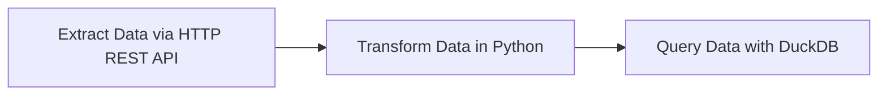

# de2-kestra-postgres-bigquery-docker-compose-full-de-pipeline-orchestration-with-AI-gemini

How to use Kestra to orchestrate data engineering pipelines with local setup using Docker compose.

## Installing Kestra

To install Kestra, we are going to use Docker Compose. We already have a Postgres database set up, along with pgAdmin. We can continue to use these with Kestra but we'll need to make a few modifications to our Docker Compose file.

Use this example Docker Compose file to correctly add the 2 new services and set up the volumes correctly.

Add information about setting a username and password.

We'll set up Kestra using Docker Compose containing one container for the Kestra server and another for the Postgres database:

```bash
cd <<.. to your working directory ... >>
docker compose up -d
```

Note: Check that pgAdmin isn't running on the same ports as Kestra. If so, check out the FAQ at the bottom of the README.

Once the container starts, you can access the Kestra UI at http://localhost:8080.
Refer to docker-compose.yml for default username and password:

```bash
username: "admin@kestra.io" # it must be a valid email address
password: Admin1234
```

To shut down Kestra, go to the same directory and run the following command:

```bash
docker compose down
```

## Add Flows to Kestra

Flows can be added to Kestra by copying and pasting the YAML directly into the editor, or by adding via Kestra's API.

To start building workflows in Kestra, we need to understand a number of concepts.

- [Flow](https://go.kestra.io/de-zoomcamp/flow) - a container for tasks and their orchestration logic.
- [Tasks](https://go.kestra.io/de-zoomcamp/tasks) - the steps within a flow.
- [Inputs](https://go.kestra.io/de-zoomcamp/inputs) - dynamic values passed to the flow at runtime.
- [Outputs](https://go.kestra.io/de-zoomcamp/outputs) - pass data between tasks and flows.
- [Triggers](https://go.kestra.io/de-zoomcamp/triggers) - mechanism that automatically starts the execution of a flow.
- [Execution](https://go.kestra.io/de-zoomcamp/execution) - a single run of a flow with a specific state.
- [Variables](https://go.kestra.io/de-zoomcamp/variables) - key–value pairs that let you reuse values across tasks.
- [Plugin Defaults](https://go.kestra.io/de-zoomcamp/plugin-defaults) - default values applied to every task of a given type within one or more flows.
- [Concurrency](https://go.kestra.io/de-zoomcamp/concurrency) - control how many executions of a flow can run at the same time.

While there are more concepts used for building powerful workflows, these are the ones we're going to use to build our data pipelines.

### The basic workflow

The flow [`01_hello_world.yaml`](flows/01_hello_world.yaml) showcases all of these concepts inside of one workflow:

- The flow has 5 tasks: 3 log tasks and a sleep task
- The flow takes an input called `name`.
- There is a variable that takes the `name` input to generate a full welcome message.
- An output is generated from the return task and is logged in a later log task.
- There is a trigger to execute this flow every day at 10am.
- Plugin Defaults are used to make both log tasks send their messages as `ERROR` level.
- We have a concurrency limit of 2 executions. Any further ones made while 2 are running will fail.

Now that we've built our first workflow, we can take it a step further by adding Python code into our flow. In Kestra, we can run Python code from a dedicated file or write it directly inside of our workflow.

### The Python in the Docker container workflow

While Kestra has a huge variety of plugins available for building your workflows, you also have the option to write your own code and have Kestra execute that based on schedules or events. This means you can pick the right tools for your pipelines, rather than the ones you're limited to.

In our example Python workflow, [`02_python.yaml`](flows/02_python.yaml), our code fetches the number of Docker image pulls from DockerHub and returns it as an output to Kestra. This is useful as we can access this output with other tasks, even though it was generated inside of our Python script.

#### Resources - Workflows

- [Tutorial](https://go.kestra.io/de-zoomcamp/tutorial)
- [Workflow Components Documentation](https://go.kestra.io/de-zoomcamp/workflow-components)
- [How-to Guide: Python](https://go.kestra.io/de-zoomcamp/python)

## Hands-On Coding Project: Build Data Pipelines with Kestra

Next, we're gonna build ETL pipelines for Yellow and Green Taxi data from NYC’s Taxi and Limousine Commission (TLC). You will:

1. Extract data from [CSV files](https://github.com/DataTalksClub/nyc-tlc-data/releases).
2. Load it into Postgres or Google Cloud (GCS + BigQuery).
3. Explore scheduling and backfilling workflows.

### Getting Started Pipeline

This introductory flow is added just to demonstrate a simple data pipeline which extracts data via HTTP REST API, transforms that data in Python and then queries it using DuckDB. For this stage, a new separate Postgres database is created for the exercises. 



Add the flow [`03_getting_started_data_pipeline.yaml`](flows/03_getting_started_data_pipeline.yaml) from the UI if you haven't already and execute it to see the results. Inspect the Gantt and Logs tabs to understand the flow execution.

#### Resources - ETL

- [ETL Tutorial Video](https://go.kestra.io/de-zoomcamp/etl-tutorial)
- [ETL in 3 Minutes](https://go.kestra.io/de-zoomcamp/etl-get-started)

