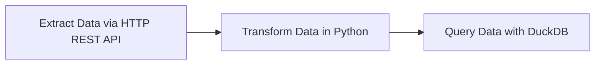
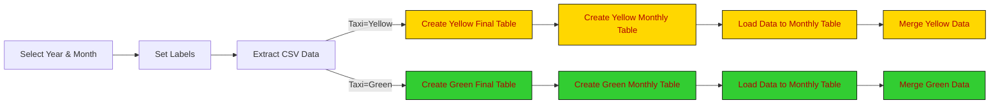
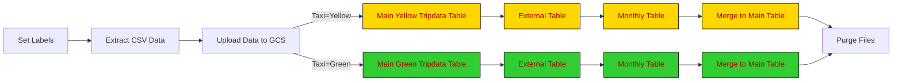

# de2-kestra-postgres-bigquery-docker-compose-full-de-pipeline-orchestration-with-AI-gemini

How to use Kestra to orchestrate data engineering pipelines with local setup using Docker compose.

## Installing Kestra

To install Kestra, we are going to use Docker Compose. We already have a Postgres database set up, along with pgAdmin. We can continue to use these with Kestra but we'll need to make a few modifications to our Docker Compose file.

Use this example Docker Compose file to correctly add the 2 new services and set up the volumes correctly.

Add information about setting a username and password.

We'll set up Kestra using Docker Compose containing one container for the Kestra server and another for the Postgres database:

```bash
cd <<.. to your working directory ... >>
docker compose up -d
```

Note: Check that pgAdmin isn't running on the same ports as Kestra. If so, check out the FAQ at the bottom of the README.

Once the container starts, you can access the Kestra UI at http://localhost:8080.
Refer to docker-compose.yml for default username and password:

```bash
username: "admin@kestra.io" # it must be a valid email address
password: Admin1234
```

To shut down Kestra, go to the same directory and run the following command:

```bash
docker compose down
```

## Add Flows to Kestra

Flows can be added to Kestra by copying and pasting the YAML directly into the editor, or by adding via Kestra's API.

To start building workflows in Kestra, we need to understand a number of concepts.

- [Flow](https://go.kestra.io/de-zoomcamp/flow) - a container for tasks and their orchestration logic.
- [Tasks](https://go.kestra.io/de-zoomcamp/tasks) - the steps within a flow.
- [Inputs](https://go.kestra.io/de-zoomcamp/inputs) - dynamic values passed to the flow at runtime.
- [Outputs](https://go.kestra.io/de-zoomcamp/outputs) - pass data between tasks and flows.
- [Triggers](https://go.kestra.io/de-zoomcamp/triggers) - mechanism that automatically starts the execution of a flow.
- [Execution](https://go.kestra.io/de-zoomcamp/execution) - a single run of a flow with a specific state.
- [Variables](https://go.kestra.io/de-zoomcamp/variables) - key–value pairs that let you reuse values across tasks.
- [Plugin Defaults](https://go.kestra.io/de-zoomcamp/plugin-defaults) - default values applied to every task of a given type within one or more flows.
- [Concurrency](https://go.kestra.io/de-zoomcamp/concurrency) - control how many executions of a flow can run at the same time.

While there are more concepts used for building powerful workflows, these are the ones we're going to use to build our data pipelines.

### The basic workflow

The flow [`01_hello_world.yaml`](flows/01_hello_world.yaml) showcases all of these concepts inside of one workflow:

- The flow has 5 tasks: 3 log tasks and a sleep task
- The flow takes an input called `name`.
- There is a variable that takes the `name` input to generate a full welcome message.
- An output is generated from the return task and is logged in a later log task.
- There is a trigger to execute this flow every day at 10am.
- Plugin Defaults are used to make both log tasks send their messages as `ERROR` level.
- We have a concurrency limit of 2 executions. Any further ones made while 2 are running will fail.

Now that we've built our first workflow, we can take it a step further by adding Python code into our flow. In Kestra, we can run Python code from a dedicated file or write it directly inside of our workflow.

### The Python in the Docker container workflow

While Kestra has a huge variety of plugins available for building your workflows, you also have the option to write your own code and have Kestra execute that based on schedules or events. This means you can pick the right tools for your pipelines, rather than the ones you're limited to.

In our example Python workflow, [`02_python.yaml`](flows/02_python.yaml), our code fetches the number of Docker image pulls from DockerHub and returns it as an output to Kestra. This is useful as we can access this output with other tasks, even though it was generated inside of our Python script.

#### Resources - Workflows

- [Tutorial](https://go.kestra.io/de-zoomcamp/tutorial)
- [Workflow Components Documentation](https://go.kestra.io/de-zoomcamp/workflow-components)
- [How-to Guide: Python](https://go.kestra.io/de-zoomcamp/python)

## Hands-On Coding Project: Build Data Pipelines with Kestra

Next, we're gonna build ETL pipelines for Yellow and Green Taxi data from NYC’s Taxi and Limousine Commission (TLC). You will:

1. Extract data from [CSV files](https://github.com/DataTalksClub/nyc-tlc-data/releases).
2. Load it into Postgres or Google Cloud (GCS + BigQuery).
3. Explore scheduling and backfilling workflows.

### Getting Started Pipeline

This introductory flow is added just to demonstrate a simple data pipeline which extracts data via HTTP REST API, transforms that data in Python and then queries it using DuckDB. For this stage, a new separate Postgres database is created for the exercises.



Add the flow [`03_getting_started_data_pipeline.yaml`](flows/03_getting_started_data_pipeline.yaml) from the UI if you haven't already and execute it to see the results. Inspect the Gantt and Logs tabs to understand the flow execution.

#### Resources - ETL

- [ETL Tutorial Video](https://go.kestra.io/de-zoomcamp/etl-tutorial)
- [ETL in 3 Minutes](https://go.kestra.io/de-zoomcamp/etl-get-started)

### Local DB: Load Taxi Data to Postgres

Before we start loading data to GCP, we'll first play with the Yellow and Green Taxi data using a local Postgres database running in a Docker container. We will use the same database from Module 1 which should be in the same Docker Compose file as Kestra.

The flow will extract CSV data partitioned by year and month, create tables, load data to the monthly table, and finally merge the data to the final destination table.



The flow code: [`04_postgres_taxi.yaml`](flows/04_postgres_taxi.yaml).

> [!NOTE]  
> The NYC Taxi and Limousine Commission (TLC) Trip Record Data provided on the [nyc.gov](https://www.nyc.gov/site/tlc/about/tlc-trip-record-data.page) website is currently available only in a Parquet format, but this is NOT the dataset we're going to use in this course. For the purpose of this course, we'll use the **CSV files** available [here on GitHub](https://github.com/DataTalksClub/nyc-tlc-data/releases). This is because the Parquet format can be challenging to understand by newcomers, and we want to make the course as accessible as possible — the CSV format can be easily introspected using tools like Excel or Google Sheets, or even a simple text editor.

#### Resources - Docker-compose and PGAdmin

- [Docker Compose with Kestra, Postgres and pgAdmin](docker-compose.yml)

### 2.3.3 Local DB: Learn Scheduling and Backfills

We can now schedule the same pipeline shown above to run daily at 9 AM UTC. We'll also demonstrate how to backfill the data pipeline to run on historical data.

Note: given the large dataset, we'll backfill only data for the green taxi dataset for the year 2019.

The flow code: [`05_postgres_taxi_scheduled.yaml`](flows/05_postgres_taxi_scheduled.yaml).

## 2.4 ELT Pipelines in Kestra: Google Cloud Platform

Now that you've learned how to build ETL pipelines locally using Postgres, we are ready to move to the cloud. In this section, we'll load the same Yellow and Green Taxi data to Google Cloud Platform (GCP) using:

1. Google Cloud Storage (GCS) as a data lake  
2. BigQuery as a data warehouse.

### 2.4.1 - ETL vs ELT

Earlier we made a ETL pipeline inside of Kestra:

- **Extract:** Firstly, we extract the dataset from GitHub
- **Transform:** Next, we transform it with Python
- **Load:** Finally, we load it into our Postgres database

While this is very standard across the industry, sometimes it makes sense to change the order when working with the cloud. If you're working with a large dataset, like the Yellow Taxi data, there can be benefits to extracting and loading straight into a data warehouse, and then performing transformations directly in the data warehouse. When working with BigQuery, we will use ELT:

- **Extract:** Firstly, we extract the dataset from GitHub
- **Load:** Next, we load this dataset (in this case, a csv file) into a data lake (Google Cloud Storage)
- **Transform:** Finally, we can create a table inside of our data warehouse (BigQuery) which uses the data from our data lake to perform our transformations.

The reason for loading into the data warehouse before transforming means we can utilize the cloud's performance benefits for transforming large datasets. What might take a lot longer for a local machine, can take a fraction of the time in the cloud.

Over the next few videos, we'll look at setting up BigQuery and transforming the Yellow Taxi dataset.

#### Resources - ETL vs ELT

- [ETL vs ELT Video](https://go.kestra.io/de-zoomcamp/etl-vs-elt)
- [Data Warehouse 101 Video](https://go.kestra.io/de-zoomcamp/data-warehouse-101)
- [Data Lakes 101 Video](https://go.kestra.io/de-zoomcamp/data-lakes-101)

### Setup Google Cloud Platform (GCP)

Before we start loading data to GCP, we need to set up the Google Cloud Platform. 

First, adjust the following flow [`06_gcp_kv.yaml`](flows/06_gcp_kv.yaml) to include your service account, GCP project ID, BigQuery dataset and GCS bucket name (_along with their location_) as KV Store values:

- GCP_PROJECT_ID
- GCP_LOCATION
- GCP_BUCKET_NAME
- GCP_DATASET.

#### Create GCP Resources

If you haven't already created the GCS bucket and BigQuery dataset, you can use this flow to create them: [`07_gcp_setup.yaml`](flows/07_gcp_setup.yaml).

#### Resources - GCP

- [Set up Google Cloud Service Account in Kestra](https://go.kestra.io/de-zoomcamp/google-sa)

### GCP Workflow: Load Taxi Data to BigQuery

Now that Google Cloud is set up with a storage bucket, we can start the ELT process.



The flow code: [`08_gcp_taxi.yaml`](flows/08_gcp_taxi.yaml).

### GCP Workflow: Schedule and Backfill Full Dataset

We can now schedule the same pipeline shown above to run daily at 9 AM UTC for the green dataset and at 10 AM UTC for the yellow dataset. You can backfill historical data directly from the Kestra UI.

Since we now process data in a cloud environment with infinitely scalable storage and compute, we can backfill the entire dataset for both the yellow and green taxi data without the risk of running out of resources on our local machine.

The flow code: [`09_gcp_taxi_scheduled.yaml`](flows/09_gcp_taxi_scheduled.yaml).

## Using AI for Data Engineering in Kestra

This section builds on what you learned earlier in Module 2 to show you how AI can speed up workflow development.

By the end of this section, you will:

- Understand why context engineering matters when collaborating with LLMs
- Use AI Copilot to build Kestra flows faster
- Use Retrieval Augmented Generation (RAG) in data pipelines

### Prerequisites

- Completion of earlier sections (Workflow Orchestration with Kestra)
- Kestra running locally
- Google Cloud account with access to Gemini API (there's a generous free tier!)

---

### Introduction: Why AI for Workflows?

As data engineers, we spend significant time writing boilerplate code, searching documentation, and structuring data pipelines. AI tools can help us:

- **Generate workflows faster**: Describe what you want to accomplish in natural language instead of writing YAML from scratch
- **Avoid errors**: Get syntax-correct, up-to-date workflow code that follows best practices

However, AI is only as good as the context we provide. This section teaches you how to engineer that context for reliable, production-ready data workflows.

### Context Engineering with ChatGPT

Let's start by seeing what happens when AI lacks proper context.

#### Experiment: ChatGPT Without Context

1. **Open ChatGPT in a private browser window** (to avoid any existing chat context):
https://chatgpt.com

2. **Enter this prompt:**

   ```bash
   Create a Kestra flow that loads NYC taxi data from a CSV file to BigQuery. The flow should extract data, upload to GCS, and load to BigQuery.
   ```

3. **Observe the results:**
   - ChatGPT will generate a Kestra flow, but it likely contains:
     - **Outdated plugin syntax** e.g., old task types that have been renamed
     - **Incorrect property names** e.g., properties that don't exist in current versions
     - **Hallucinated features** e.g., tasks, triggers or properties that never existed

#### Why Does This Happen?

Large Language Models (LLMs) like GPT models from OpenAI are trained on data up to a specific point in time (knowledge cutoff). They don't automatically know about:

- Software updates and new releases
- Renamed plugins or changed APIs

This is the fundamental challenge of using AI: **the model can only work with information it has access to.**

#### Key Learning: Context is Everything

Without proper context:

- ❌ Generic AI assistants hallucinate outdated or incorrect code
- ❌ You can't trust the output for production use

With proper context:

- ✅ AI generates accurate, current, production-ready code
- ✅ You can iterate faster by letting AI generate boilerplate workflow code

Below we'll see how Kestra's AI Copilot solves this problem.

### AI Copilot in Kestra

Kestra's AI Copilot is specifically designed to generate and modify Kestra flows with full context about the latest plugins, workflow syntax, and best practices.

#### Setup AI Copilot

Before using AI Copilot, you need to configure Gemini API access in your Kestra instance.

**Step 1: Get Your Gemini API Key**

1. Visit Google AI Studio: https://aistudio.google.com/app/apikey
2. Sign in with your Google account
3. Click "Create API Key"
4. Copy the generated key (keep it secure!)

> [!WARNING]  
> Never commit API keys to Git. Always use environment variables or Kestra's KV Store.

**Step 2: Configure Kestra AI Copilot**

Add the following to your Kestra configuration. You can do this by modifying your `docker-compose.yml` file from 2.2:

```yaml
services:
  kestra:
    environment:
      KESTRA_CONFIGURATION: |
        kestra:
          ai:
            type: gemini
            gemini:
              model-name: gemini-2.5-flash
              api-key: ${GEMINI_API_KEY}
```

Then restart Kestra:

```bash
cd << .. your project dir... >>
export GEMINI_API_KEY="your-api-key-here"

# OR IN WINDOWS 
$env:GEMINI_API_KEY="your-api-key-here"

# Then verify:
echo $env:GEMINI_API_KEY

docker compose up -d
```

#### Exercise: ChatGPT vs AI Copilot Comparison

**Objective:** Learn why context engineering matters.

1. **Open Kestra UI** at http://localhost:8080
2. **Create a new flow** and open the Code editor panel
3. **Click the AI Copilot button** (sparkle icon ✨) in the top-right corner
4. **Enter the same exact prompt** we used with ChatGPT:

   ```bash
   Create a Kestra flow that loads NYC taxi data from a CSV file to BigQuery. The flow should extract data, upload to GCS, and load to BigQuery.
   ```

5. **Compare the outputs:**
   - ✅ Copilot generates executable, working YAML
   - ✅ Copilot uses correct plugin types and properties
   - ✅ Copilot follows current Kestra best practices

**Key Learning:** Context matters! AI Copilot has access to current Kestra documentation, generating Kestra flows better than a generic ChatGPT assistant.
